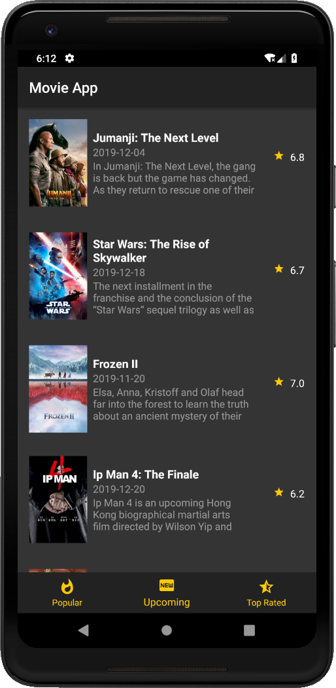
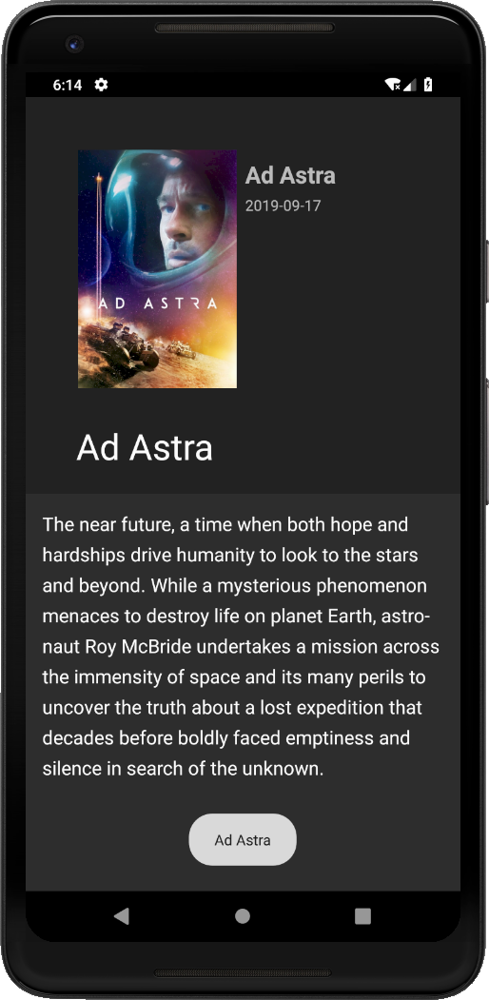
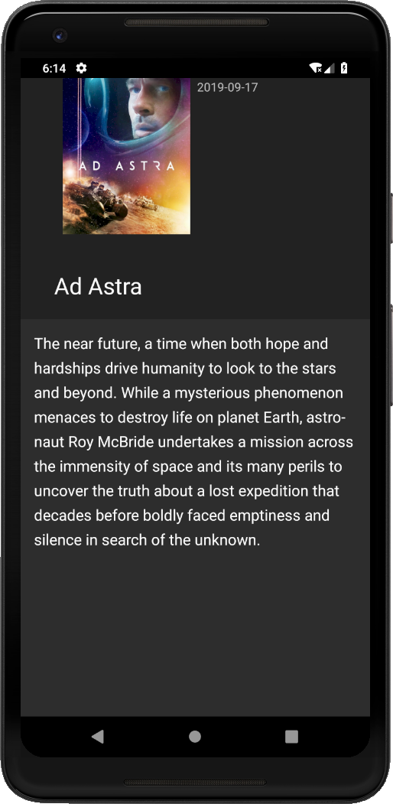
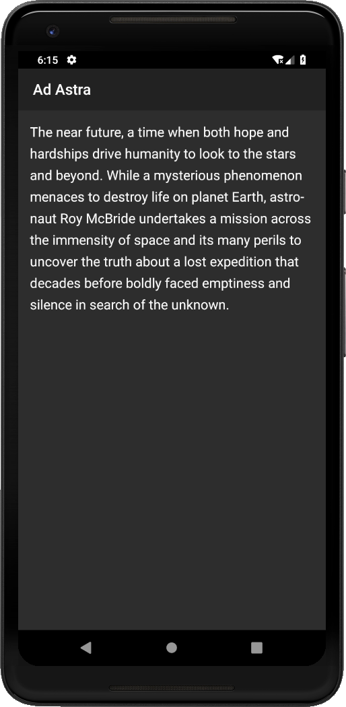

# Movie App

## Présentation

Réalisation d'une application Android dans le cadre d'un projet de programmation mobile.
Cette application présente les films les plus populaires, cux à venir et les mieux notés via une APIRest.

<i>Lien de l'APIRest : https://www.themoviedb.org/documentation/api</i>

<br/>

## Prérequis

- Installer Android Studio </br>
- Récupérer le projet </br>
- Ouvrir le projet sur Android Studio </br>

Lien du projet : </br>
<https://github.com/RomainPestre/MovieApp.git> </br>

- APK présente à la racine du projet ```https://github.com/RomainPestre/MovieApp/app-debug.apk``` </br>
Lien de téléchargement : <https://github.com/RomainPestre/MovieApp/raw/master/app-debug.apk>

## Utilisations techniques

- Java </br>
- Retrofit </br>
- Architecture MVC </br>
- Gitflow </br>
- APIRest </br>
- Fragments </br>
- RecyclerView </br>
- ScrollView </br>
- CollapsingToolbar </br>
- Ecrans multiples : </br>
	- Liste des films les plus populaires via RecyclerView </br>
	- Liste des films à venir via RecyclerView </br>
	- Liste des films les mieux notés via RecyclerView </br>
	- Détails du film sélectionné </br>

## Utilisation de l'application - Captures d'écrans

### Launcher de l'application
 </br>

### Ouverture de l'application
 </br>

### Liste des films les plus populaires (Titre - Date de sortie - Description - Note)
 </br>

### Liste des films à venir (Titre - Date de sortie - Description - Note)
 </br>

### Liste des films les mieux notés (Titre - Date de sortie - Description - Note)
 </br>

### Sélection d'un film - Affichage des détails
 </br>

### Défilement de l'écran
 </br>

### Affichage de la description seulement
 </br>

## Problèmes majeurs rencontrés

### Problèmes
L'application n'arrivait pas à communiquer avec l'API à cause d'une erreur de communication </br>
L'application ne fonctionnait pas sur Android Pie (9.0)(API level 28) </br>
Affichage des affiches de films disfonctionnel </br>

Message d'erreur : </br>
```
E/MainActivity: java.net.UnknownServiceException: CLEARTEXT communication to api.themoviedb.org not permitted by network security policy
```

 </br>

### Résolutions

Résolution : </br>
Modification du ```AndroidManifest.xml``` et création du ```network_security_config.xml``` </br>

## Améliorations possibles

- Mettre à disposition plus d'informations sur les films (exemple : ajouter les affiches ou le genre du film) </br>
- Ajouter d'autres fragments accessibles depuis le menu de navigation </br>
- Rechercher un film grâce à une barre de recherche </br>
- Utiliser le stockage en cache </br>